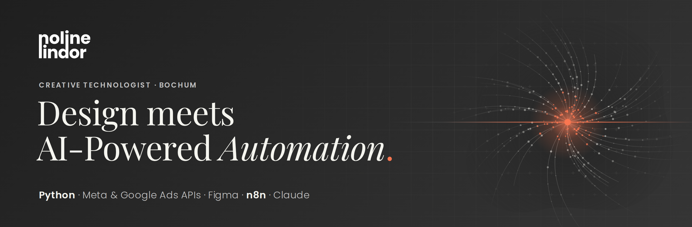

 

I build systems that replace manual marketing work. My background is design, my tools are code and AI: Python automations on the Meta Marketing API, Google Ads Scripts, n8n and Claude workflows and dashboards that bring data from several sources into one place. The design side makes sure people can actually work with what I build.

**[Portfolio](https://nolinelindor.com)** &nbsp;·&nbsp; **[LinkedIn](https://www.linkedin.com/in/noline-lindor-43b923213)** &nbsp;·&nbsp; **[Email](mailto:nolinelindor@gmail.com)**

 

### WHAT I BUILD

**Campaign automation.** Monthly ad set creation for 100+ Meta campaigns via Python and the Meta Marketing API. What used to take around 12 hours by hand is now a single script run.

**Data-driven dashboards.** A full-stack KPI dashboard consolidating HubSpot, LinkedIn and web analytics. Custom API adapters, a KPI registry and deployment on EU infrastructure.

**Design automation.** Location-specific print posters through data merge: 30 posters in 20 minutes instead of 4 hours, error-free and reproducible.

 

### PROJECTS

| Project | What it does | Stack |
|:--|:--|:--|
| **[Portfolio](https://github.com/Noline-Loni/Portfolio)** | My personal site, live at [nolinelindor.com](https://nolinelindor.com) | `React` `TypeScript` `Vite` `Tailwind` |
| **[Space Jump](https://github.com/Noline-Loni/space-jump)** | Endless platformer in space: jump, collect hearts, race a spaceship. [Play it](https://space-jump-ten.vercel.app) | `HTML` `JavaScript` |
| **Meta Ads Automation** | Creates ad sets for 100+ locations automatically | `Python` `Meta Marketing API` |
| **KPI Dashboard** | Marketing KPIs from three sources in one place | `Node.js` `Fastify` `PostgreSQL` `React` |
| **Job Ad Checker** | Finds linked job postings that have expired | `Python` `Web Scraping` |
<!-- Add new projects as a row. With a repo link:
| **[Project name](https://github.com/Noline-Loni/repo-name)** | One sentence on what it does | `Tech` `Tech` |
-->

Projects without a link are client work. The code is confidential, case studies live on <a href="https://nolinelindor.com">nolinelindor.com</a>.

 

### STACK

**Automation & code** &nbsp; `Python` `JavaScript` `TypeScript` `Node.js` `React` `PostgreSQL` `REST APIs` `Google Ads Scripts`  
**AI & workflows** &nbsp; `Claude` `n8n` `Cursor` `Agent Skills` `Prompt Engineering`  
**Marketing tech** &nbsp; `Meta Ads` `Google Ads` `GA4` `Google Tag Manager`  
**Design** &nbsp; `Figma` `Adobe XD` `InDesign` `Illustrator` `Photoshop` `Blender`

 

### RIGHT NOW

Building my own projects in public instead of only behind client doors. Tools, experiments and automations that save other people time will land here step by step.

 

noline lindor · Bochum, Germany
